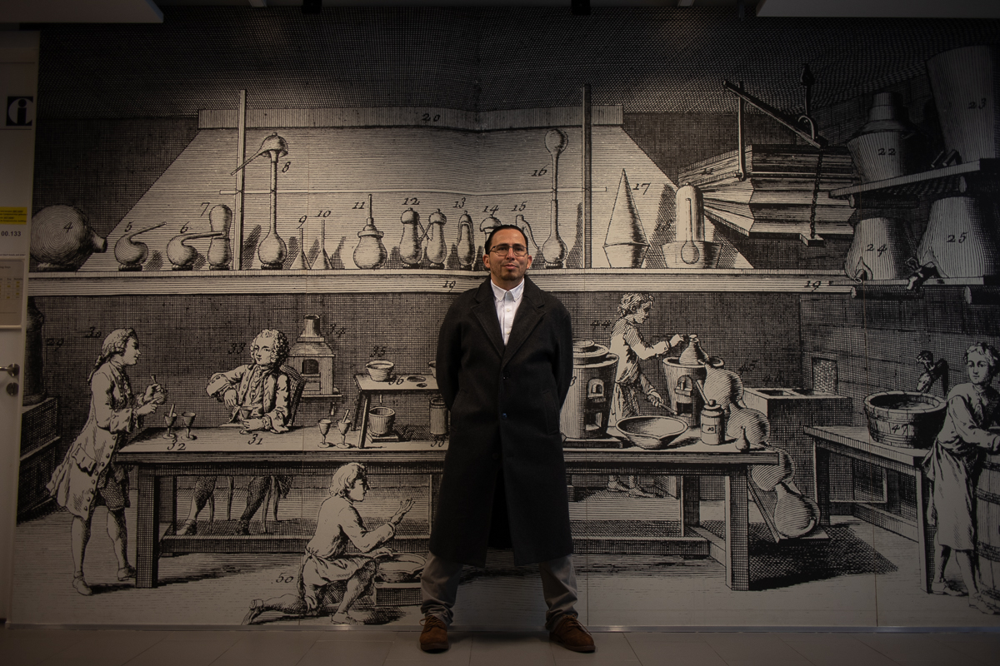

### Formal Education 

--- 

- **Doctor of Science (Chemistry)** - Universidad Nacional de Colombia  
July 2014 - August 2020	

- **Bachelor of Science (Chemistry)** - Universidad Nacional de Colombia  
January 2003 - October 2008

- **Technologist in industrial chemistry (Chemistry)** - Servicio Nacional de aprendizaje - SENA  
January 2000 - Febrary 2003	

### Research Internships

---

- **Research training in Biorefinery chemistry** - Max Planck Institute - Colloids and Interfaces, Postdam 
September 2018 - January 2019

### Skills and Relevant Training

---

**Leadership, Project Management, Metrology, and Quality**

- 2023: Lead Auditor ISO/IEC 17025:2017 Based on ISO 19011:2018 Update
- 2013: ISO 17025:2005 Internal Auditor by SGS
- 2003: NTC ISO Quality Standards and Their Implementation in Companies

**Communication Skills and Academic Expression**

- 2022: English, Pronunciation and Intonation for Young Researchers by Ku Leuven
- 2022: Academic Writing by Ku Leuven
- 2022: Coaching Skills for Postdocs by Ku Leuven
- 2008: Management of Virtual Classrooms for Teaching Support
- 2013: Intellectual Production and Writing Certificate by Salle University

::: {.column-margin}
{.margin-photo}
:::

**Software and Office Skills**

- 2022: Advanced Excel, Pivot Tables by Ku Leuven
- 2023: Python as a Second Language by Ku Leuven

**Technical Skills**

- 2013: Certificate in Chromatography by National University
- 2012: Certificate in Operation of Shimadzu Gas Chromatograph Mass Spectrometer by Shimadzu
- 2011: Work Environment Management by Instituto Colombiano Agropecuario	

