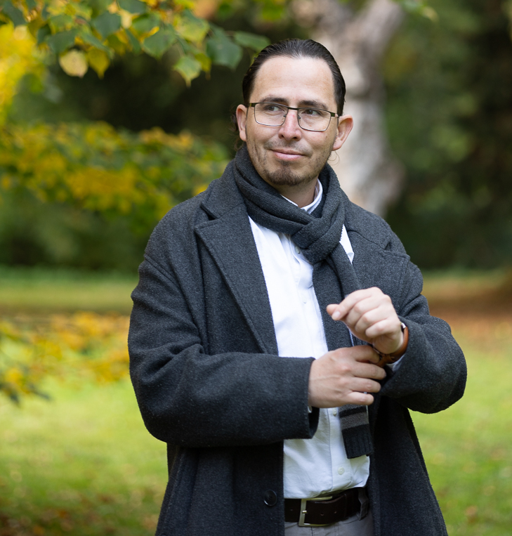

:::: {.columns}

::: {.column width="35%"}
<center>
{.photo}
</center>

---

```{=html}
<div class="contact-buttons">
    <a href="mailto:jose.alirio.mm@gmail.com" class="button">
        <i class="fas fa-envelope"></i> E-mail
    </a>
    <a href="https://www.linkedin.com/in/jose-alirio-mendoza-mesa-3b3798239" target="_blank" class="button">
        <i class="fab fa-linkedin"></i> LinkedIn
    </a>
    <a href="https://x.com/alirio_mm" target="_blank" class="button">
        <i class="fa-brands fa-square-x-twitter"></i> X
    </a>
</div>
```
### Key interests

::: {.justify}
- Catalyst Design
- CO2 Valorisation
- Metrology specialized ISO 17025:2017
- Advanced chemistry characterization
- Biorefinery and sustainable chemistry
:::

:::

::: {.column width="5%"}
:::

:::{.column width="60%"}

<center>
***If you've made it here, you've likely seen my résumé. This website is not a replacement but a way to explore my personal brand more deeply​***
</center>
<br>

::: {.justify}
As a chemist with over 15 years of experience and a PhD in Science, I specialise in heterogeneous catalysis and its applications within green chemistry and sustainable technologies. I have developed innovative catalyst materials that provide efficient, eco-friendly solutions to global challenges, such as carbon dioxide valorization and sustainable energy production. By combining strategic planning with quality assurance, I have created novel strategies for information analysis, enabling data-driven decision-making based on reliable information.

I have a proven track record of leading cutting-edge research projects in both academic and industrial settings. My work has been instrumental in advancing catalytic processes, focusing on designing catalysts that enhance performance while minimising environmental impact. Throughout my research and industrial career, I have effectively led teams and contributed to multiple projects, including CO2 conversion, reactor design, and the development and validation of analytical tools. My strong communication skills have been tested through mentoring master’s and doctoral students, and I have also trained teams in analytical techniques, building their competencies to tackle complex technical challenges.

I possess a solid foundation in analytical techniques, laboratory quality control, and risk evaluation, coupled with a passion for driving innovation in heterogeneous catalysis to address future sustainability challenges. I am always eager to engage in discussions about sustainable catalysis and welcome opportunities for collaboration, knowledge exchange, and scientific advancement.

<br>

:::{.phrase}
*There is no value in knowledge if it doesn’t serve others*
:::
:::
:::
::::
