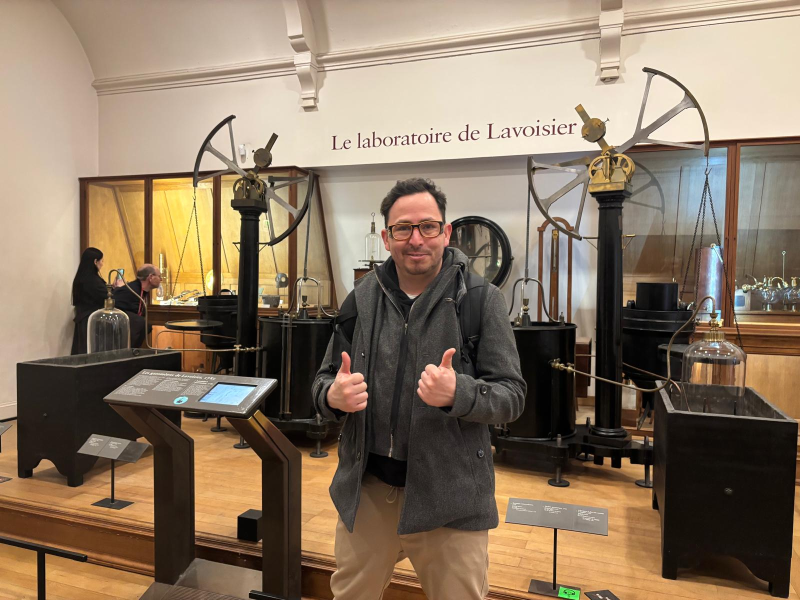
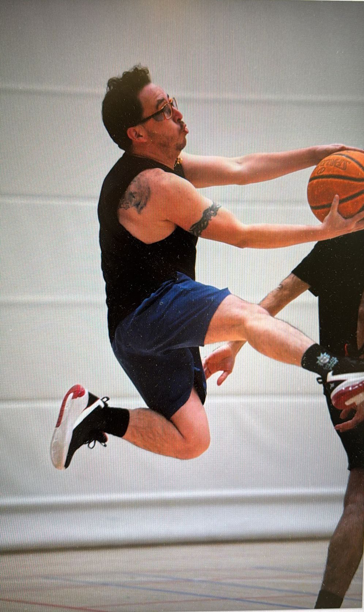

### Curious about History

I’m passionate about understanding how humanity and science have evolved. I enjoy exploring not only how things work, but how we reached today’s knowledge — from early experiments to modern discoveries. (See photo visiting Lavoisier’s exhibit.)

{width=80%}

---

## Team Player on the Court

Basketball is my weekly dose of teamwork and strategy. I value the game’s rhythm, communication, and the importance of being in the right place at the right time.

{width=50%}

---

## Language Enthusiast-Current days Dutch

I love learning languages — currently focusing on Dutch. (See my 2024 video explaining a Colombian recipe.) It combines my passion for languages, my Colombian identity, and my love for cooking.

