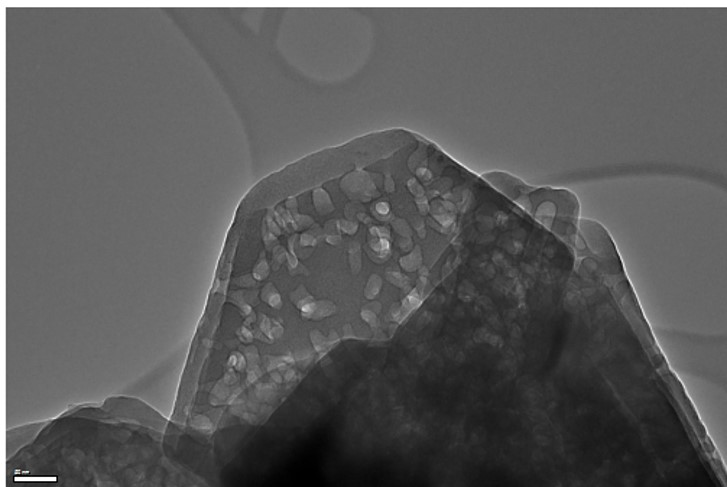

## Publications

- [Tuning oxidative propane dehydrogenation while co-converting CO2 over vanadium containing CHA zeolites](https://pubs.rsc.org/en/content/articlelanding/2025/cy/d4cy01242a) 
<strong>Mendoza Mesa, J.A.</strong>; Shah, M.; Rigamonti, M., Eloy,P., Debecker P., Khan, I., Dusselier, M. 
Catalysis Science & Technology (2025). doi.org/10.1039/D4CY01242A

- [Support effects in vanadium incipient wetness impregnation for oxidative and non-oxidative propane dehydrogenation catalysis](https://www.sciencedirect.com/science/article/abs/pii/S0920586124000403) 
<strong>Mendoza Mesa, J.A.</strong>, Robijns S., Ali Khan I., Rigamonti M.G., Bols M., Dusselier M. 
Catalysis Today 430 (2024) 114546 Contents

::: {.column-margin}
{.margin-photo}
    

{.margin-photo}
    

{.margin-photo}
:::

- [Alkylaromatic mass transport – acidity properties correlation for commercial and mesostructured Y zeolites with the catalytic behavior of cracking reactions](https://www.sciencedirect.com/science/article/pii/S1566736724000505) 
Tavera-Méndez, C., <strong>Mendoza Mesa, J.A.</strong>, Vargas, J. C.

- [p-Xylene from 2,5-dimethylfuran and acrylic acid using zeolite in continuous flow system](https://pubs.rsc.org/en/content/articlelanding/2020/gc/d0gc01517b) 
<strong>Mendoza Mesa, J.A.</strong>, Brandi, F.; Irina, S.; Antonietti, M.; Al-Naji, M. 
Green Chemistry, 2020. doi.org/10.1039/D0GC01517B

- [Metal-free visible-light-Induced dithiol−Ene Clicking via Carbon Nitride to Valorize 4‑Pentenoic Acid as a Functional Monomer](https://pubs.acs.org/doi/full/10.1021/acssuschemeng.9b05351) 
<strong>Mendoza Mesa, J.A.</strong>; Kumru, B.; Antonietti, M.; Al-Naji M. 
ACS Sustainable Chemistry & Engineering, 2019; 7:17574 - 17579. doi:10.1021/acssuschemeng.9b05351

- Collaborative writing using Internet tools 
<strong>Mendoza Mesa, J.A.</strong>; Trujillo, C. 
Research strategy, culture development and Doctoral Support: Tools and Techniques for Latin American Universities - Octubre-2018 
ISBN: 9781905866915 ed: Latin American University Research and Doctoral, p.195 - 206, 2018

## Patents

- Generation of mesopores in zeolites by hydrothermal treatment with preservation of acidity  
**Mendoza Mesa, J.A.**; Trujillo, C.; Pérez Martínez, D.J.  
Ecopetrol-Universidad Nacional de Colombia. 2020.  
Submitted 30 th december 2019. Number:  NC2019/0015011

::: {.column-margin}
{.margin-photo}
:::

## Honors and Awards

- **Department of Chemistry, Max Planck Institute Fellowship (2018 - October 2019):** 
Awarded a six-month fellowship, extended for three additional months based on performance. Published two significant papers in biorefinery under Majd Al Naji’s supervision.

- **PhD Colciencias Fellowship (2015-2018):**
Competitive loan from the Colombian government covering PhD tuition and living expenses, converted to a full scholarship (100% exemption) based on PhD results and academic performance.

- **ICFES Award - Highest High School Score, Colombia (December 1999):**
Achieved the highest score in my school’s history, ranking in the top 20 nationwide in Colombia’s ICFES exam.